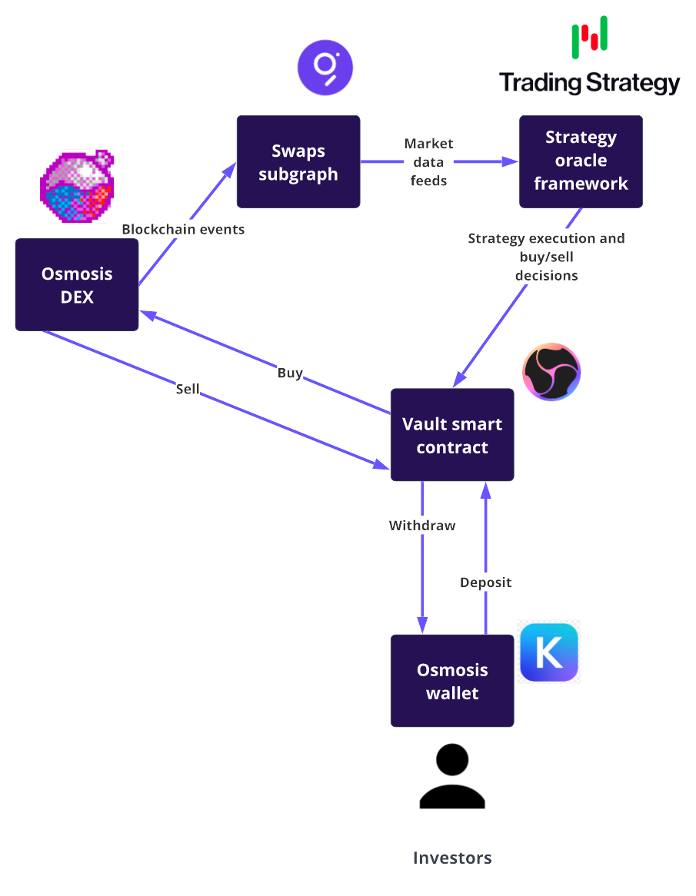

<p align="center">
  
  <h1 align="center">Algosm</h1>
</p>

https://algosm.zone

Algosm is a hackathon project for HackAtom Seoul 2022. Algosm enables
developing noncustodial active trading strategies on Osmosis DEX using CosmWasm smart contract
and [Trading Strategy offchain oracles](https://tradingstrategy.ai/docs/). 
Users deposit to Algosm vault smart contracts which trade on Osmosis, by buying low and selling high based
on technical analysis and trading algorithms written in Python.

Typical active trading strategies may include strategies like mean reversion,
momentum and trend following. Active trading provides more sustainable
yield than liquidity mining, as it is based on true profits. Furthermore,
active trading generates trading fees for Osmosis.

## Architecture



## Quick walk through

Below is a quick walk through of deliverables of this hackathon:

- Create one simple example strategy that trades on Osmosis
- Read all Osmosis token swaps using hosted TheGraph API in [store_price.py](hackatom_2022/store_price.py) to CSV
  - [Deployed Subgraph](https://thegraph.com/hosted-service/subgraph/miohtama/hackatom-2022)
  - [Subgraph source code](https://github.com/miohtama/hackatom-2022)
- ATOM/OSMO OHLCV candle processing in [analyse.ipynb](hackatom_2022/analyse.ipynb), saved as Parquet
- [CosmWasm vault smart contracts for deposits](./frontsie/counter-dapp/contracts)
- [Beaker based frontend](./frontsie/counter-dapp/frontend)

## How to run this demo

### Collect historical price data

Obtain raw Osmosis swap events using [subgraph](https://github.com/miohtama/hackatom-2022)

```shell
poetry install
python hackatom_2022/store_price.py
```

This will generate 600 MB `swaps.csv`.

### Create and examine OHLCV candle data

Use [OHLCV Jupyter Notebook](hackatom_2022/analyse.ipynb).

### Run backtests 

See example ALGO/OSMO mean reversion algorithm in the backtesting notebook.

Use [backtest Jupyter Notebook](hackatom_2022/analyse.ipynb).

### Deploy contracts

Use [Beaker](frontsie/counter-dapp).

### Run frontend locally

Use [Vercel](frontsie/counter-dapp).

```shell
cd frontsie/counter-dapp/frontend
yarn dev
```

# Team

- [Mikko Ohtamaa](twitter.com/moo9000/)
- [Mike Purvis](https://twitter.com/mikedotexe)
- Teddy Knox
- Mykhailo Donchenko

## Hackathon story

The idea grew and morphed with mostly completion, but also stretch goals partially complete.

The first step was to look into how to get an indexer working for Osmosis so Mikko's knowledge of investment strategies could align with the network and its historical data.

We were able to contact James Bayly from SubGraph and Adam Fuller from The Graph, and set up a good MVP system. To learn more about these two indexer solutions available on Cosmos blockchains, check out these links:

- https://thegraph.com/docs/en/supported-networks/cosmos (great examples at the bottom)
- https://subquery.medium.com/subquery-cosmos-juno-support-developer-deep-dive-e317969633ea

After reaching a level of satisfaction for a hackathon, moved to using the Osmosis tooling. We used `beaker`, `osmojs`, `telescope`, and `LocalOsmosis` to set up our system. The goal was to create a custom frontend that would call a smart contract on Osmosis we wrote (this is modified from the example and lives at `frontsie/counter-dapp/contracts/counter`) that would take OSMO and then do a swap using Osmosis bindings. The bindings part did not complete in time, but is quite doable in a day, we believe.

Along the way there were some excellent discussions with mentors and participants that we'd like to highlight.

We believe all of us learned some valuable information about installing beaker on different systems, and it did seem like upgrading Rust and remembering to run `cargo install cargo-wasm` was key to getting `beaker` to install. We hope those conversations helped that tool become more robust.

Since our goal was to eventually do a swap from a smart contract, we looked into how to create our own custom tokens and create a pool on Osmosis. This took to an interesting turn, eventually leading to great conversations with the Osmosis core team about an issue with the `tokenfactory`. Shoutout to all the folks who helped, especially Dan Lynch, who eventually created this issue [detailing the problem](https://github.com/osmosis-labs/osmosis/issues/2259). This was actually quite a fascinating deep dive into protobufs and amino signing, and well worth the detour.


In our efforts to try out the Osmosis bindings, we used an example from a custom branch recommended to us by Xiangan He:
https://github.com/osmosis-labs/cw-tpl-osmosis/blob/xiangan/example/src/contract.rs

This gave us enough knowledge to discover the `Swap` [functionality here](https://docs.rs/osmo-bindings/0.5.1/osmo_bindings/struct.Swap.html).


(Note that for this project, we copied the version `0.6.0` instead of the published crate which looked a bit older.)

While we weren't able to wrap up the swap functionality, we have a head start in this pull request:
https://github.com/mikedotexe/hackatom-2022-osmosis-algorithmic-trading-solution/tree/add-basic-osmo-bindings


We were not able to get the swap complete by the time the hackathon ended.

All in all, we learned a ton about the ecosystem and feel like we've all got a handle on the tooling and possibilities.

Thank you, HackAtom Seoul 2022!

